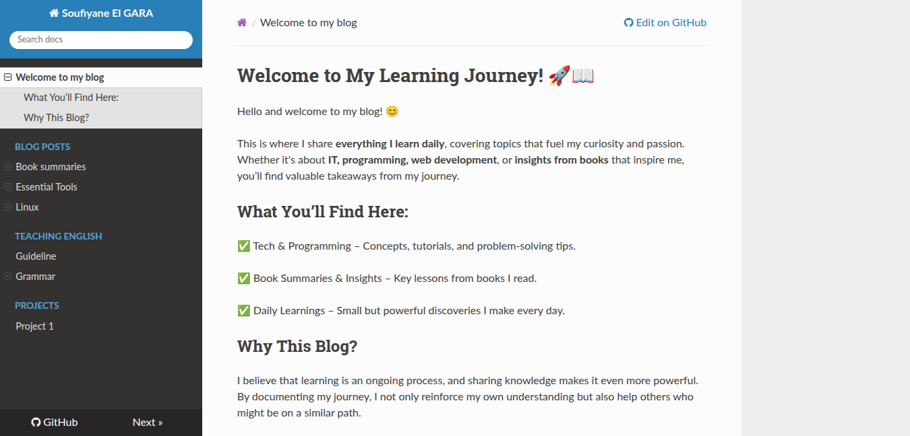

# My Technical Documentation Blog

A personal blog where I document and share everything I learn, mainly focusing on **IT topics and book insights**. This blog serves as a structured knowledge base, making it easy to access and revisit key learnings.

🔗 Live Project: [https://soufiyaneelgara.github.io/]

# How It's Made:

### 🛠 Tech Used: MkDocs, HTML, CSS, JavaScript

This blog is built using **MkDocs**, a static site generator designed for project documentation. I customized the theme and styling using **HTML**, **CSS**, and **JavaScript** to improve readability and user experience. The site structure is optimized for easy navigation, ensuring that topics are well-organized and accessible.

# Optimizations:

* Implemented **a clean and minimal design** for distraction-free reading.

* Optimized site performance by keeping assets lightweight.

* Used MkDocs' built-in **search functionality** for quick access to topics.

* Ensured **mobile responsiveness** for an optimal experience on all devices.

# Lessons Learned:

This project reinforced the importance of **structured documentation** and how it improves both learning and knowledge sharing. I gained hands-on experience with **MkDocs**, static site generation, and front-end customization. Additionally, I learned the importance of **user experience** in presenting technical content effectively.
